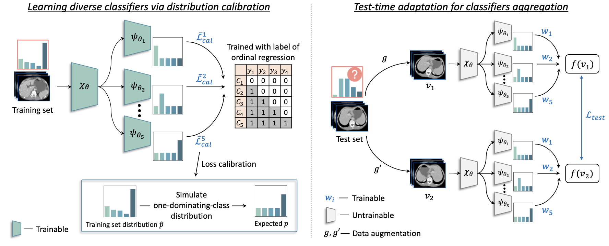
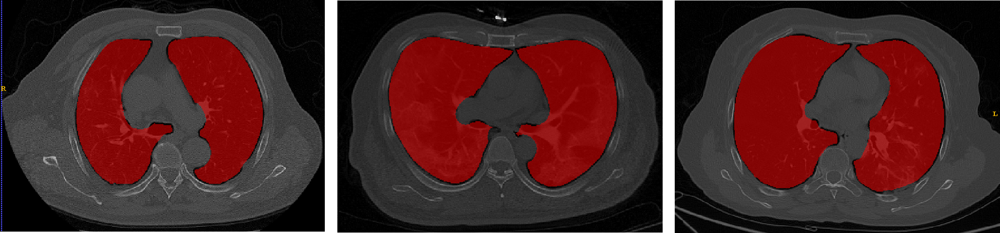

# Implement TTADC on a public available dataset

## Introduction

Pytorch implementation for MICCAI 2022 paper **[Test-time Adaptation with Calibration of Medical Image Classification Nets for Label Distribution Shift
](https://github.com/med-air/TTADC/)**

<p align="center">

</p>

## Abstract
> Class distribution plays an important role in learning deep classifiers. When the proportion of each class in the test set differs from the training set, the performance of classification nets usually degrades. Such a label distribution shift problem is common in medical diagnosis since the prevalence of disease vary over location and time. In this paper, we propose the first method to tackle label shift for medical image classi- fication, which effectively adapt the model learned from a single training label distribution to arbitrary unknown test label distribution. Our ap- proach innovates distribution calibration to learn multiple representative classifiers, which are capable of handling different one-dominating-class distributions. When given a test image, the diverse classifiers are dynam- ically aggregated via the consistency-driven test-time adaptation, to deal with the unknown test label distribution. We validate our method on two important medical image classification tasks including liver fibrosis stag- ing and COVID-19 severity prediction. Our experiments clearly show the decreased model performance under label shift. With our method, model performance significantly improves on all the test datasets with different label shifts for both medical image diagnosis tasks.

## Setup

```bash
Package                Version
---------------------- -------------------
h5py                   3.1.0
numpy                  1.15.4
opencv-python          4.5.2.52
pandas                 1.1.5
SimpleITK              2.0.2
Scikit-learn           0.24.2
torch                  1.4.0
torchvision            0.5.0
```

## Dara preparing

#### 1. Access to the iCTCF dataset: https://ngdc.cncb.ac.cn/ictcf/HUST-19.php
#### 2. Use an unsupervised algorithm (**[COVID-MTL](https://github.com/guoqingbao/COVID-MTL)**) illustrated in [1] to segment the region of lung.
<p align="center">

</p>


[1] Bao, G., Chen, H., Liu, T., Gong, G., Yin, Y., Wang, L., Wang, X.: Covid-mtl: Multitask learning with shift3d and random-weighted loss for covid-19 diagnosis and severity assessment. Pattern Recognition 124, 108499 (2022) 6

#### 3. Generate preprocessed data and the labels.
```bash 
python preprocessing.py
```

#### 4. Sort out the data and code.
```bash
.
├── code
│   ├──datasets
│   │       └── dataset_*.py
│   ├──train.py
│   ├──test.py
│   └──...
├── models_save
│   └── iCTCF
└── data
    └──Synapse
        ├── iCTCF_train
        │   ├── Patient-1.npy.h5
        │   └── *.npy.h5
        └── iCTCF_test
            ├── Patient-1000.npy.h5
            └── *.npy.h5
```

## Training
```bash 
python train.py --max_epoch 45 --model_path <your model path>
```
## Testing
```bash 
python test.py --model_path <your model path>
```

## Citation
If this repository is useful for your research, please cite:

       @article{ma2022ttadc,
         title={Test-time Adaptation with Calibration of Medical Image Classification Nets for Label Distribution Shift},
         author={Ma, Wenao and Chen, Cheng and Zheng, Shuang and Qin, Jing and Zhang, Huimao and Dou, Qi},
         journal={International Conference on Medical Image Computing and Computer Assisted Intervention},
         year={2022}
       }  


